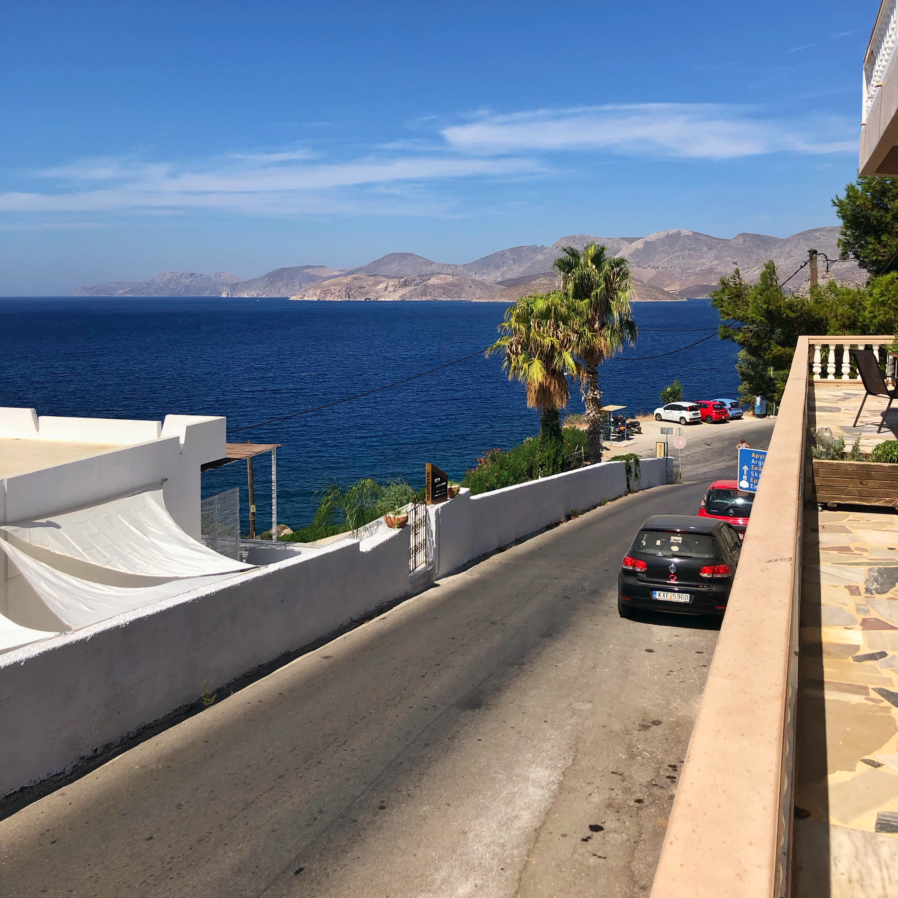
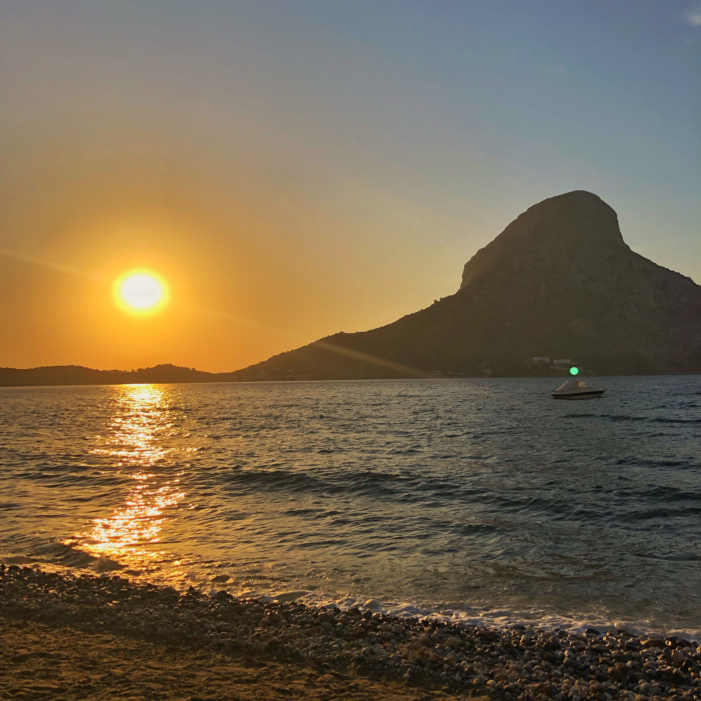
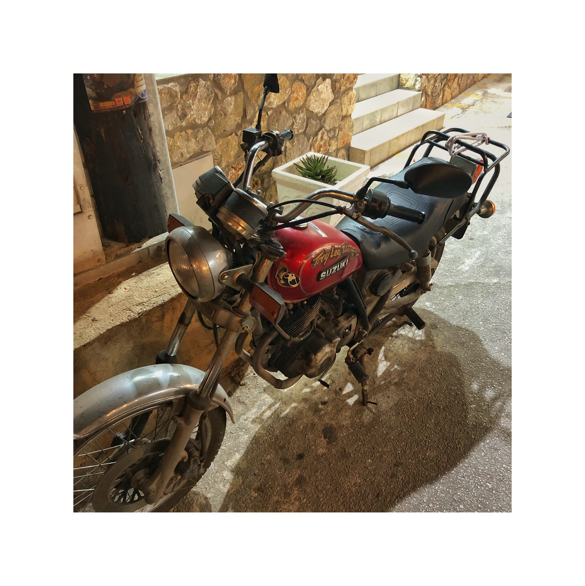

Partiti di notte e atterrati a Kos verso le 11.
Taxi, non sono mai fortuanato con i taxi, trovo sempre dei matti che vanno ai 100 all'ora in contromano giudando con le ginocchia.
Questo taxi ci lascia al traghetto per Kalymnos. 

Il traghetto va che è una bomba. Impenna un sacco.
Acqua ovunque.

Secondo taxi, come al solito un matto totale che cerca di venderci la qualunque. Dal motorino al ristorante.

Arriviamo alla casa, che è molto carina. Poi purtroppo scopro subito che l'acqua dai rubinetti sa comunque di sale. Lavarsi i denti è una goduria. Però c'è una vista spettacolare e in più siamo vicinissimi ai negozietti della via "principale".

Il posto è piccolo (Myrties), ma c'è molta vita. 
Tanti scalatori, come è giusto che sia.

Pranzo al ristorante, aperitivo in spiaggia e primo bagnetto.
La spiaggia è di sassi e la corrente è molto forte. Lettini free con consumazione, voto 100.

Super gelatone per chiudere la giornata e poi tutti a nanna.

Giornata pesantissima, ma che giornata!

## Le foto della giornata

