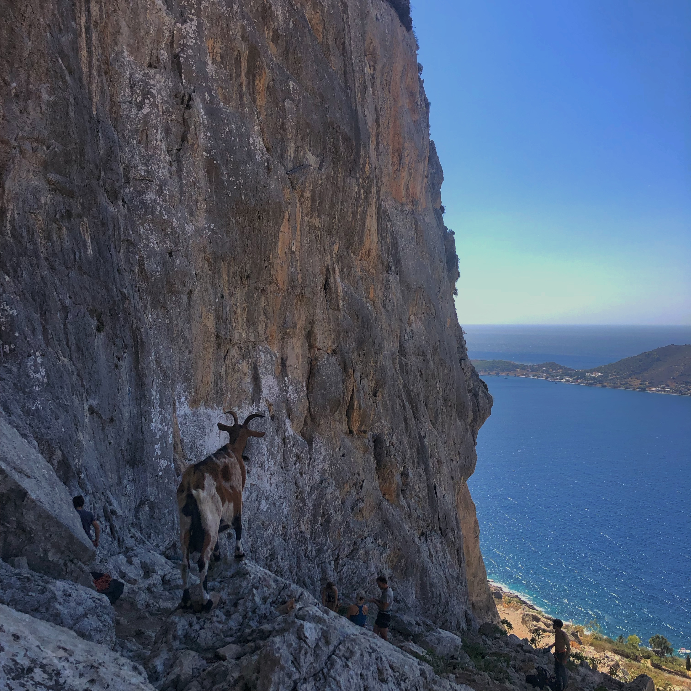
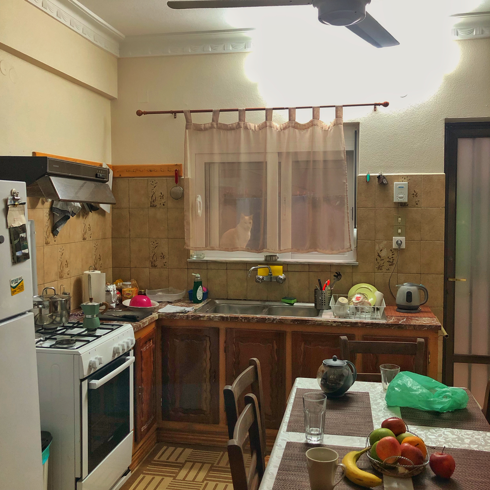

Oggi siamo andati in falesia vicino all'appartamento.
Sono riuscito a chiudere Origano (5a), Nonno Ringo (5c), Blu (6a).
È una delle prime volte in falesia all'esterno per me e sono contento di essere riuscito a portare a casa un 6a.

Domani spero di scalare più vie e possibilmente riuscire a chiudere un 6b. Devo imparare a gestire meglio i piedi, ho fatto un sacco di fatica durante la prima via.

## Le foto della giornata

