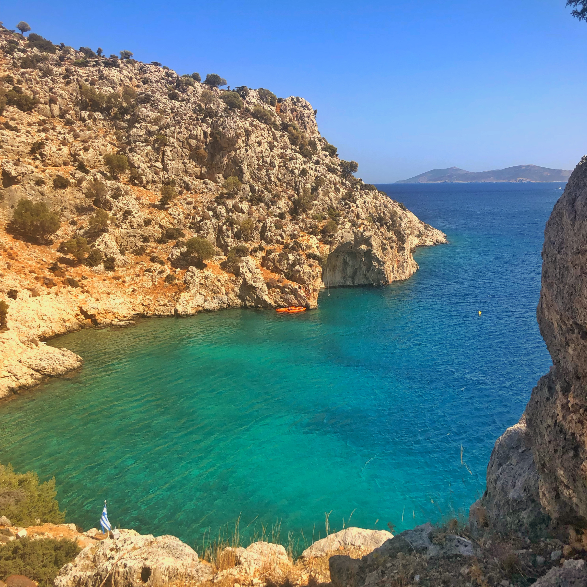
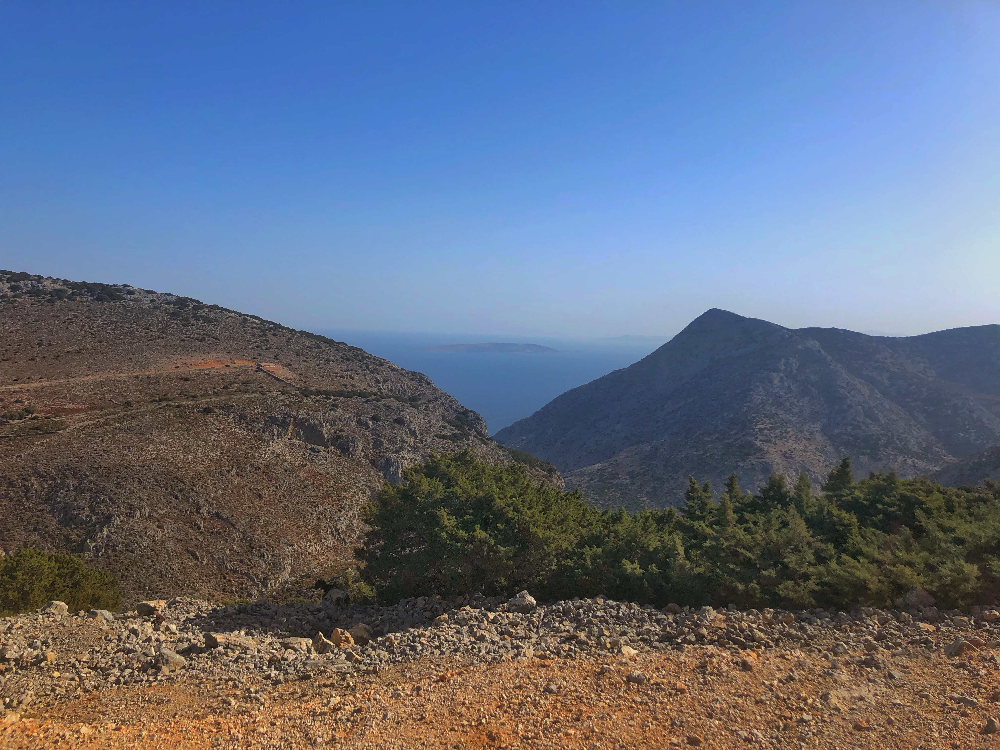

Oggi doveva essere il giorno di scarico, di riposo.

Spoiler, non è andata proprio così.

Il piano era di fare il giro dell'isola e fermarci in qualche tappa per fare delle foto e goderci la vista. Ci siamo fermati su una grande altura piena di capre su una cresta. Abbiamo incrociato diversi cacciatori lungo la strada. Non pensavo si riuscisse a cacciare su quest'isola, ma a quanto pare va di moda.

I paesetti sembrano quasi disabitati, credo che durante il giorno si spostino tutti verso i porti o le località turistiche se non stanno tappati in casa per il caldo.

Putroppo abbiamo trovato la chiesetta chiusa al pubblico. Se per caso avete in mente di passare a dare un'occhiata assicuratevi che sia aperta, altrimenti non ne vale la pena. Mi pare che l'isola non abbia molte cose non naturlai da vedere. Avendola girata più o meno tutta posso dire che ci sono molti ruderi in giro, qualche borghetto nascosto ma di base il turismo sta in piedi per il mare bellissimo e ovviamente gli arrampicatori. Sono ancora stupito dal numero di falesie in sto posto. Tutto è relativamente recente, ma si sono messi a chiodare all'infinito e sicuramente c'è un sacco di potenziale ancora inespresso. Mi dicono che sta man mano—se non lo è già—diventando un parco divertimenti come Gardaland. Se volete provare dei tiri venite qui il prima possibile prima che si unga troppo.

Ci siamo poi fermati in un porto molto carino con due bar di fronte all'acqua. Decidiamo un attimo cosa fare e optiamo per fare un'escursione che DOVREBBE portarci su una spiaggia molto bella ma semi nascosta. Con chiaramente anche delle falesiette. L'alternativa è quella di farsi portare con il barchino o noleggiare un kayak. FATELO.

Avevamo visto che la strada era na roba da mezz'ora. Avevo voglia di stiracchiare la caviglia quindi decidiamo di fare due passi.
Partiamo in due coppie. Gli altri erano molto più allenati di noi, con equipaggiamento migliore e scorte di acqua più abbondanti. Ci staccano subito. 

Nel mentre noi arranchiamo sull'alta scogliera non riuscendo a trovare un sentiero fatto bene. Ogni tanto c'erano degli omini di pietre per segnare la direzione, fatti da altri escursionisti. Quindi trovandoli con una certa frequenza ci siamo spinti sempre più avanti finchè non c'è più niente.

## Persi

Al che proclamo che ci siamo ufficiamente "persi". Lo metto tra virgolette perchè sapevamo esattamente dove eravamo, ma la strada si stava facendo man mano sempre più pericolosa e il sole picchiava troppo forte per proseguire in sicurezza. Chiamiamo gli altri e ci confermano che il pezzo finale era oltremodo pericoloso e lungo da eseguire. In dearrampicata oltreutto. Torniamo quindi di poco indietro alla chiesetta che avevamo incontrato—ovviamente chiusa—con la promessa che due ore più tardi sarebbero passati con il barchino a prenderci.

Con scorte d'acqua quasi esaurite e una mezza insolazione ci ripariamo sotto un albero e poco dopo facciamo un bagno, l'acqua meravigliosa. Poco distante c'era gente che stava facendo deep water. Il posto è bellissimo (foto 1) ma non eravamo proprio nel mood di rilassarci del tutto. 

All'ora prevista vengono a recuperarci e scappiamo a gambe levate.

Non siamo mai stati in pericolo, ho fatto decisamente di peggio, ma non è stata esattamente la passeggiata o comunque la giornata più rilassante di sempre. La caviglia non dava assolutamente una mano.

Mettiamola così. Abbiamo avuto la nostra bella dose di avventura inaspettata.

Pro tip: se dovete fare escursioni su queste isole
- informatevi molto, molto, MOLTO bene sul percorso. Le guide e il GPS non bastano. Chiedete ai local
- non esistono setieri tenuti bene. Scordatevi segnali ben tenuti, strade battute e sostegni. I setieri spesso spariscono, le rocce tagliano e la flora sembra voglia uccidervi. Usate scarpe da avvicinamento/scarponcini seri
- portatevi sempre più acqua di quella che pensavate di portare. Non ci sono fontanelle o simili. Ne potete trovare solo nei paesi un po' più grandi

## Le foto della giornata

