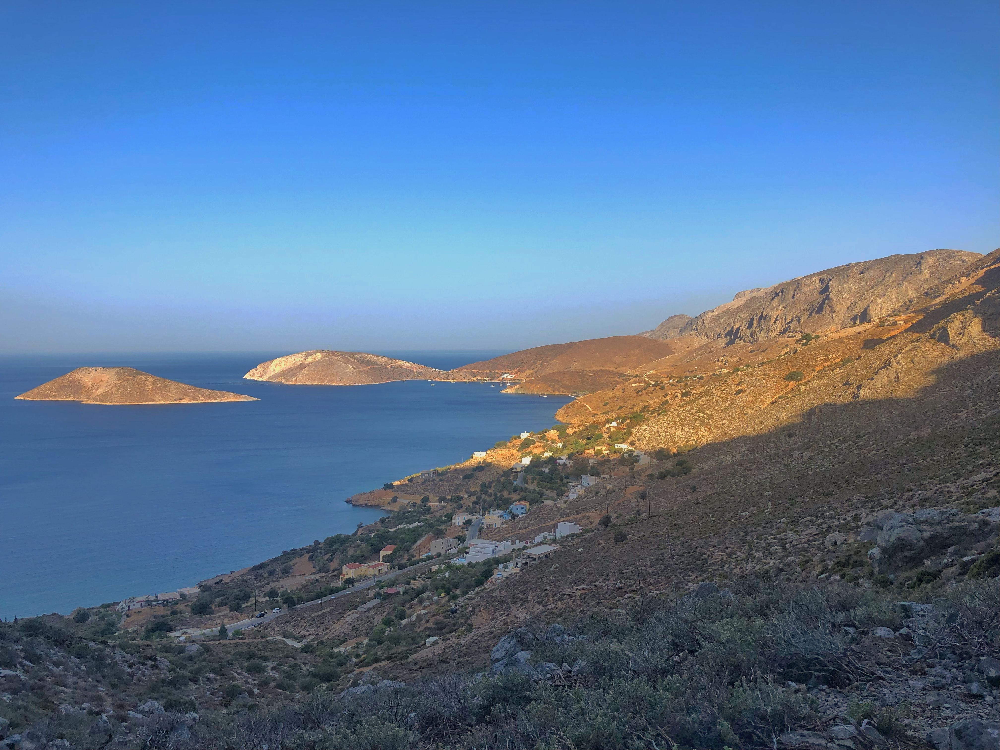

Giornata caldissima, sembra quasi sia arrivata l'estate rispetto agli altri giorni. Abbiamo fatto molta fatica a trovare le energie.

Sono riuscito a fare il mio promo 5a da primo in esterna.
Ancora non mi tengono bene i piedi. Non mi fido. Devo fare più esercizio in esterna. Nei prossimi mesi—finchè si può—farò in modo di andare di più. Se ho capito una cosa è che il boulder comunque mi è un pò più affine. Ma si tratta solo di un'impressione a metà, devo provare di più.

Abbiamo smesso prima del solito di scalare e siamo andati alla baia dei pirati di Kalymnos. La spiaggia più bella che ho visto sull'isola. Si beve e mangia bene. Ci siamo fermati al primo bar, non quello dei pirati. Il barista mi ha respinto perchè avevamo preso da bere prima dagli altri. Per come sono stato trattato non lo raccomando, ma magari altri hanno avuto altre esperienze. La maggior parte delle volte è tutto pace e amore ma altre volte sotto sotto sembra ti stiano perculando. State all'occhio.

Dopo una birretta facciao due chicchiere con una coppia di italiani che spiaggiava sui lettini di fianco a noi—è pieno pieno di italiani sto posto. Ci godiamo il tramonto con una birretta e poi dritti verso il ristorante Maria. Si trova prima di Arginonta, in un piccolo borgo. Si mangia sotto un gigantesco platano e di fianco c'è l'unica fonte naturale di acqua potabile dell'isola. Si mangia decisamente bene. Non è Panos, ma il posto è migliore, molto più tranquillo.

Chiaramente sulla strada del ritorno doveva succedere qualcosa.
Il motorino dei nostri compagni di viaggio ha cominciato a fare il rumore di una Mustang. La marmitta ha deciso di spaccarsi per bene.
Tutto ok, ma c'era tutta Masuri che si voltava e ci guardava male ahahah.

Pro tip: Se vi servono dei motorini vi consiglio di prenotarli prima, soprattutto se arrivate in alta stagione, noi abbiamo fatto molta fatica a trovarne e quelli che ci hanno dato erano chiaramnte scarsi o con problemi.

Dopo essere stato divorato dalle zanzare per quei 10 minuti che sono stato sul balcone mi sono fiondato a letto. Un caldo e una stanchezza potentissimi. Accendo la ventola al massimo e parto per il mondo dei sogni. Questa notte finalmente senza cerotti o bende!

## Le foto della giornata

